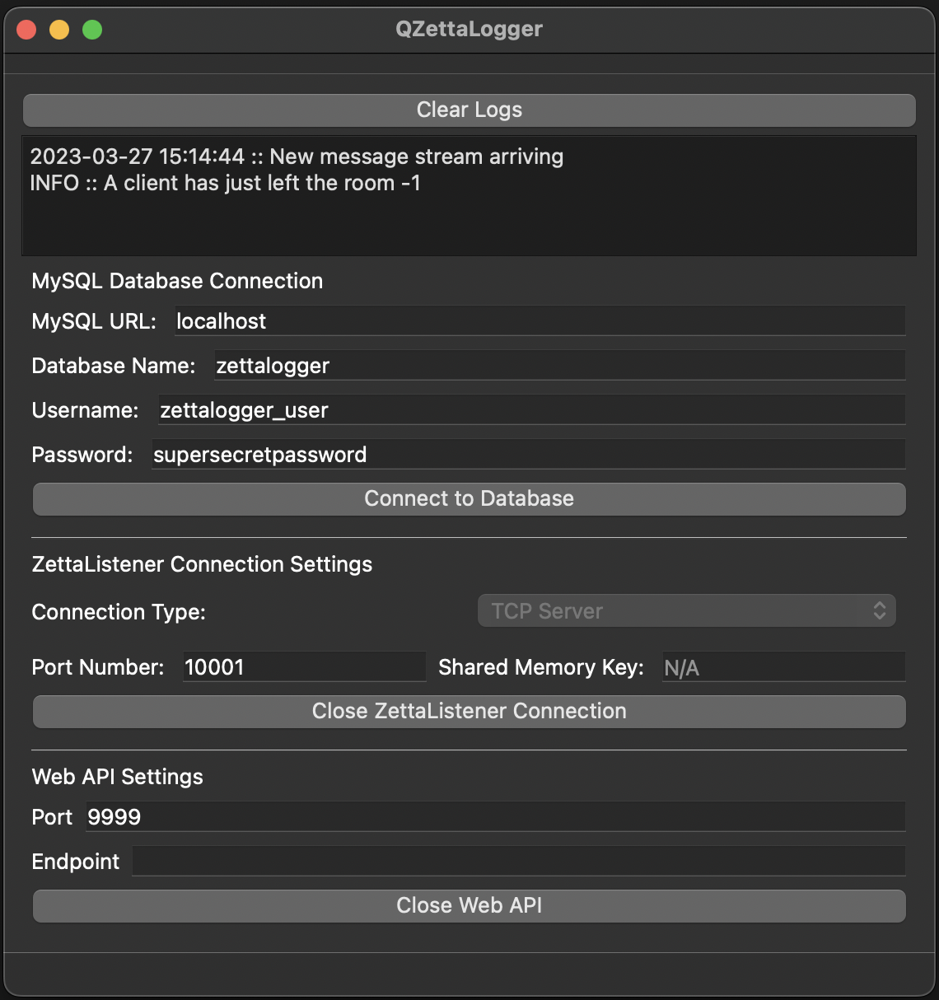

# ZettaLogger
* Receives data-stream from ZettaListener over TCP/shared-memory. 
* MySQL Connector.
* Web API to query the database 

## NEXT STEPS
* Port Web API to `Boost::Beast`
* Port Shared Memory to `Boost::IPC`